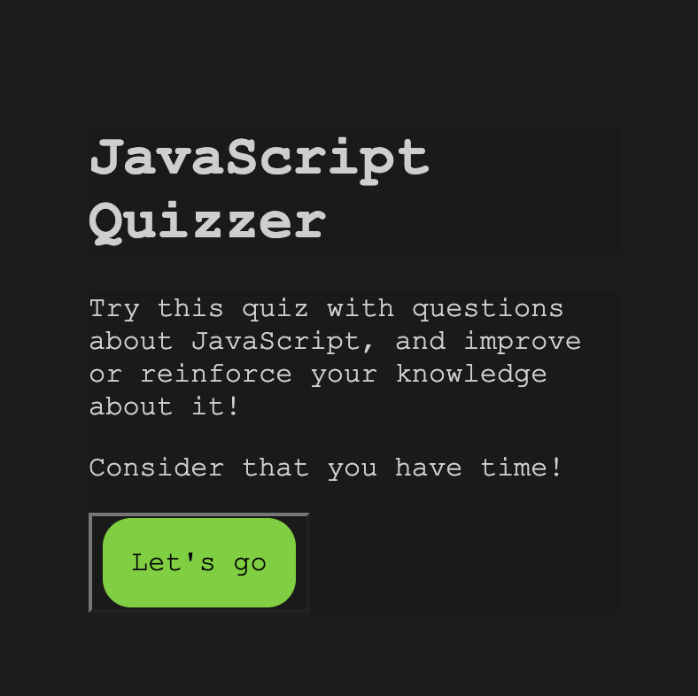

# Quizzer

## Challenge 4
This challenge is to make a quiz with timer and test your knowledge about JavaScript, different resources were needed to create it, some of the materials I used were:
Bootcamp TDM-VIRT-FSF-PT-10-2022-U-LOLC/JavaScript
https://www.youtube.com/watch?v=f4fB9Xg2JEY&t=3225s
https://www.youtube.com/watch?v=riDzcEQbX6k
https://www.educba.com/constructor-in-javascript/
https://developer.mozilla.org/es/docs/Web/JavaScript/Reference/Statements/let
https://eloquentjavascript.net/02_program_structure.html
https://developer.mozilla.org/en-US/docs/Web/JavaScript/Reference/Global_Objects/Math/random

## User Story

- AS A coding boot camp student
- I WANT to take a timed quiz on JavaScript fundamentals that stores high scores
- SO THAT I can gauge my progress compared to my peers

## Acceptance Criteria

- GIVEN I am taking a code quiz
- WHEN I click the start button
- THEN a timer starts and I am presented with a question
- WHEN I answer a question
- THEN I am presented with another question
- WHEN I answer a question incorrectly
- THEN time is subtracted from the clock
- WHEN all questions are answered or the timer reaches 0
- THEN the game is over
- WHEN the game is over
- THEN I can save my initials and score

[GitHub/Jeacqueline](https://github.com/Jeacqueline/Quizzer)

[GitHub/Jeacqueline/Quizzer]()